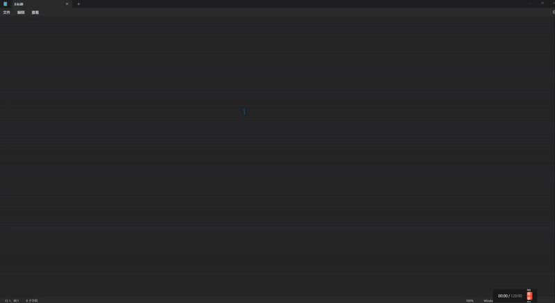

# Prompt Rose

[](https://opensource.org/licenses/MIT)
[](https://github.com/x66ccff/PromptRose/network)
[](https://github.com/x66ccff/PromptRose/stargazers)


<p align="center">
  <a href="#-what-is-prompt-rose">English</a> •
  <a href="#-prompt-rose-是什么">中文</a>
</p>

## 🌹 What is Prompt Rose?

"Prompt Rose" is a sleek productivity tool that, with just a press and hold of the shift key (customizable), brings up a radial menu similar to those found in the Battlefield game series. Instead of game commands, this menu is filled with quick prompt instructions designed for Large Language Models (LLMs). This eliminates the need for users to search through their notebooks for prompts.

Designed for Windows platforms, "Prompt Rose" also allows for prompt management directly from the right-click system tray.

<p align="center">
  
</p>

## ✨ Features

- **Intuitive Radial Menu**: Press and hold your hotkey to bring up a wheel of prompts
- **Quick Selection**: Simply move your mouse in the direction of the desired prompt and release
- **Customizable Prompts**: Add, edit, or remove prompts through an easy-to-use interface
- **Customizable Hotkey**: Choose your preferred activation key combination
- **Direct Pasting**: Automatically pastes your selected prompt into the active application
- **System Tray Integration**: Minimal footprint with easy access to all functions
- **Persistent Settings**: Your configurations are saved and loaded between sessions

## 🚀 Quick Start

1. Execute `start.bat` to launch Prompt Rose
2. Press and hold the Alt key (default) to display the prompt wheel
3. Move your mouse to select a prompt
4. Release the key to paste the selected prompt into your current application
5. Right-click the system tray icon for additional options

## 🛠️ Requirements

- Windows 10 or higher
- Python with PyQt6, keyboard, and pyperclip packages
- Conda environment named "promptrose" (used by start.bat)

## 💻 Files

- `prompt_wheel.py` - Main application
- `icon.png` / `icon.ico` - Application icons
- `create_icon.py` - Script used to generate the icon
- `start.bat` - Launcher script that activates conda environment
- `.gitignore` - Git ignore file
- `demo.gif` - Demonstration animation

## 🔧 Installation
```
conda env create -f environment.yaml
conda activate PromptRose
pip install pywin32
```

### System Tray Options

- **Show Wheel**: Manually display the prompt wheel
- **Manage Prompts**: Add, edit, or delete prompts
- **Settings**: Configure hotkeys and paste behavior
- **Exit**: Close the application

## 📝 License

This project is licensed under the MIT License.

## ☕ Support

If you find this tool useful, consider supporting its development:

<p align="center">
  <br><br>
  
</p>

---


## 🌹 Prompt Rose 是什么？

"Prompt Rose"是一款优雅的生产力工具，只需按住 shift 键（可自定义），就能呼出一个类似《战地》游戏系列中的辐射状菜单。与游戏命令不同，这个菜单中填充的是专为大型语言模型（LLMs）设计的快速提示指令。这消除了用户在笔记本中搜索提示词的需要。

专为Windows平台设计，"Prompt Rose"还允许通过右键点击系统托盘图标直接管理提示词。

<p align="center">
  
</p>

## ✨ 特点

- **直观的辐射菜单**：按住热键即可显示提示词轮盘
- **快速选择**：只需将鼠标移动到所需提示的方向并释放按键
- **可自定义提示词**：通过易用的界面添加、编辑或删除提示词
- **可自定义热键**：选择您喜欢的激活键组合
- **直接粘贴**：自动将所选提示词粘贴到活动应用程序中
- **系统托盘集成**：占用资源小，轻松访问所有功能
- **持久设置**：您的配置会在会话之间保存和加载

## 🚀 快速开始

1. 执行`start.bat`启动Prompt Rose
2. 按住Alt键（默认）显示提示词轮盘
3. 移动鼠标选择提示词
4. 释放按键将所选提示词粘贴到当前应用程序中
5. 右键点击系统托盘图标获取更多选项

## 🛠️ 系统要求

- Windows 10或更高版本
- Python与PyQt6、keyboard和pyperclip包
- 名为"promptrose"的Conda环境（由start.bat使用）

## 💻 文件说明

- `prompt_wheel.py` - 主应用程序
- `icon.png` / `icon.ico` - 应用图标
- `create_icon.py` - 用于生成图标的脚本
- `start.bat` - 激活conda环境的启动脚本
- `.gitignore` - Git忽略文件
- `demo.gif` - 演示动画

## 🔧 安装方法
```
conda env create -f environment.yaml
conda activate PromptRose
pip install pywin32
```
### 系统托盘选项

- **显示轮盘**：手动显示提示词轮盘
- **管理提示词**：添加、编辑或删除提示词
- **设置**：配置热键和粘贴行为
- **退出**：关闭应用程序

## 📝 许可证

本项目采用MIT许可证。

## ☕ 支持项目

如果您觉得这个工具有用，可以考虑支持开发者：

<p align="center">
  <br><br>
  
</p>

[](https://star-history.com/#x66ccff/PromptRose&Date)
